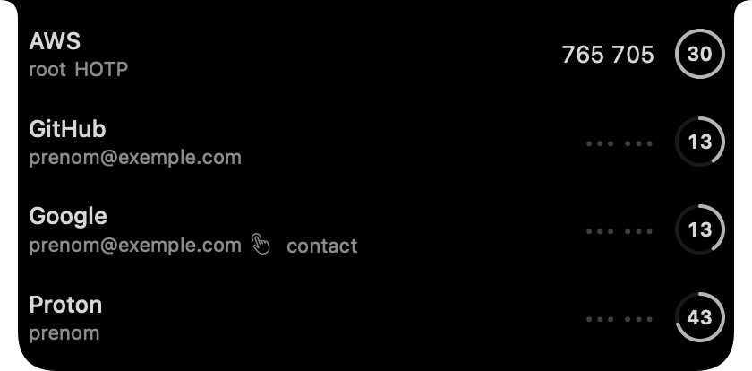
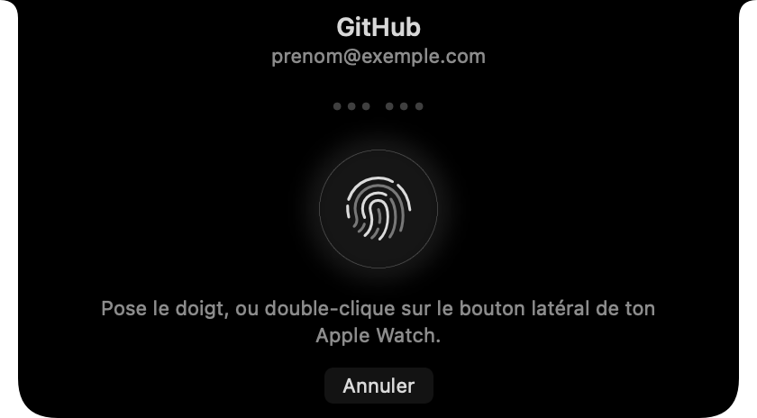

# YubicoNotch

> One-time codes in your Mac's notch — and a fingerprint for each one.

Hover the notch and the panel opens on your accounts. Click one, touch the sensor, and the
code is on your clipboard. The secrets never leave the YubiKey, nothing is stored, nothing
syncs, and **a code shown once does not come back without a new gesture**.

<p align="center">
  
  
</p>

---

## Table of Contents

- [Why this one](#why-this-one)
- [Requirements](#requirements)
- [Install](#install)
- [Usage](#usage)
- [One gesture, one code](#one-gesture-one-code)
- [Settings](#settings)
- [Security](#security)
- [Accessibility](#accessibility)
- [How it works](#how-it-works)
- [Troubleshooting](#troubleshooting)
- [Support](#support)
- [License](#license)

---

## Why this one

1. **It lives in the notch.** No window, no Dock icon, no ⌘Tab. It is there when you hover
   it and invisible otherwise — collapsed, it draws nothing at all, because those pixels do
   not exist.
2. **Your codes pile up nowhere.** A YubiKey computes TOTP/HOTP inside its OATH applet; the
   app only receives the result. No secret on disk, no sync, no online account.
3. **One gesture, one code.** The panel does not open a session: it lists your accounts, and
   every code asks for its own fingerprint. Apple's biometric prompt is drawn *inside* the
   panel — no system dialog popping up somewhere else.
4. **It does not lie about what it reads.** Opening the panel only asks the key for *names*;
   a code is computed only after your gesture, for that one account, and it disappears with
   its own validity window.

## Requirements

| | |
| --- | --- |
| **A Mac with a notch** | Without one (or on an external display), only the menu bar icon is available |
| **macOS 14 or later** | and Touch ID, or an Apple Watch, to confirm |
| **A USB-C YubiKey** | with OATH credentials already stored (`Yubico Authenticator`, or `ykman oath accounts add`) |

## Install

```bash
git clone https://github.com/millianlmx/yubico_notch.git
cd yubico_notch
./Scripts/build-app.sh
open build/YubicoNotch.app
```

Drag `YubicoNotch.app` to **Applications** to keep it, then enable *Launch at login* in the
settings — it will start quietly in the menu bar.

There is no `.xcodeproj`: SwiftPM builds, and the script assembles and signs the bundle. One
single dependency, [YubiKit](https://github.com/Yubico/yubikit-swift), pinned at 1.3.0. The
signature is ad hoc, carrying the smart-card entitlement — that is what lets the app see the
key, and it is also why you build it yourself instead of downloading it.

Demo mode, to see the panel without hardware (fake key, real TOTP maths, simulated Touch
ID):

```bash
./Scripts/build-app.sh --debug
open build/YubicoNotch.app --args -demo
```

## Usage

| State | What the app does |
| --- | --- |
| No key | The panel invites you to plug it in, and catches up the moment you do |
| Key detected | The panel lists the accounts in the OATH applet; no code is shown |
| No accounts | A welcome screen offering to add one |
| Account picked | The confirmation sheet: the fingerprint reveals the code **and** copies it |
| OATH password | An input field in the panel, with a "remember in the keychain" option |

- **Search** — `⌘F` (or the magnifier) filters the list by issuer or account.
- **Keyboard** — `↑` `↓` to move, `⏎` or `⌘C` to confirm the selected row, `Échap` to close
  the confirmation, then the search, then the panel. The shortcuts need the panel to hold
  the keyboard: hovering never takes it, clicking inside does.
- **Rename or delete** — right-click a row. Deletion asks for confirmation inside the panel:
  nothing is erased without a second click.
- **Add an account** — the `+` button in the header. Type the issuer, the account and the
  base32 secret, paste an `otpauth://` link, or read a QR code shown on screen with *Scan
  the screen*. TOTP/HOTP, 6 or 8 digits, a 30/60 s period and physical-touch requirements are
  all configurable.
- **Scan the screen** — the panel collapses, you drag a rectangle over any display (Escape
  cancels), and the `otpauth://` QR code it contains fills the form. The first time, macOS
  asks for *Screen Recording* permission.
- **Clipboard** — wiped after the delay you chose in the settings, and only if you have not
  copied something else in the meantime.
- **Lock** — erases the revealed codes and the list, and closes the OATH session, relocking
  the applet on the key. The panel stays locked while it is open; leaving the notch and
  coming back lists your accounts again. Locking is also immediate when you lock your
  session, when the display sleeps, or when the key is unplugged.

## One gesture, one code

This is Apple Pay's mechanic, transposed: the panel shows what is on the key the way Wallet
shows the cards, a sheet states what is about to be copied, and nothing leaves without a
deliberate gesture.

**Touch ID** (default) — a fingerprint, or a double-click on the side button of a paired
Apple Watch, **for every single code**. Apple's biometric control is embedded in the panel:
macOS draws its prompt in there, never in a system alert.

One subtlety that cost a lot to find: reuse lives in the `LAContext`. A context that has
already matched a finger answers the next evaluation in **about ten milliseconds, with no
new touch** — in other words, one fingerprint opened every code after it. Every confirmation
now invalidates the previous context and arms a fresh one, before the sheet even exists.
Measured after the fix: 1.40 s, 1.66 s, 1.32 s per code — the sensor genuinely waiting for a
finger each time.

**Press and hold** — the other gesture, with no sensor involved: hold the target for about a
second, the ring fills, the code arrives. For Macs without Touch ID, and for anyone who
would rather never see a biometric prompt.

If a confirmation ever went through without you touching the sensor, the log would say so:

```bash
log show --last 2m --predicate 'subsystem == "app.yubiconotch"' --style compact \
  | grep -E 'evaluatePolicy|fresh biometric'
```

## Settings

The ⚙ icon in the panel, or the menu bar menu (*Settings…*). Three tabs:

| Tab | What it holds |
| --- | --- |
| **General** | Launch at login, confirmation method, clipboard wipe delay, code masking delay |
| **YubiKey** | OATH password memorisation, and the smart-card access diagnostic |
| **About** | Name, version and build, bundle identifier, copyright |

**Launch at login** goes through `SMAppService`: the checkbox reflects the real state of the
system login item, not a preference of ours. When macOS is waiting for an approval, the
window offers to open the right pane.

## Security

- **No code is computed without a gesture.** Listing the key only reads account names; a
  code is computed only once the fingerprint — or the Apple Watch double-click, or the press
  and hold — has authorised it. A test holds that property: the key receives no code request
  before the gesture.
- The account list — issuer and name, never a code — appears as soon as the panel opens.
  That is Wallet's compromise, assumed: the cards are visible, the number is not.
- The optional OATH password is stored in the **session keychain** and only ever opens the
  applet. The biometry-protected keychain is not usable from an ad-hoc signed app
  (`errSecMissingEntitlement`, -34018). Assumed trade-off: that password alone is useless
  without the physical key.
- Locking erases the revealed codes and the list, wipes the clipboard if the copied code is
  still there, and closes the connection to relock the applet.

## Accessibility

Rows are announced to VoiceOver ("GitHub · name@example.com", value "427391, 24 seconds left
of 30" or "Code masked. Confirmation required"), buttons carry their labels, and animations
respect *Reduce Motion*.

## How it works

Two SwiftPM targets: `YubicoNotchKit` (all the logic and the views) and a twenty-line
executable. The details are in **[`docs/architecture.md`](docs/architecture.md)** — the
protocol seams that make the service testable without hardware, the state machine, the
execution model, the panel and the pointer, the embedded biometrics, the smart-card
entitlement, and the two AppKit traps the interaction tests encode.

What the app actually sends to the key — the OATH applet APDUs, the TOTP/HOTP computation,
the applet password, the `otpauth://` and Base32 rules — is in
**[`docs/protocols.md`](docs/protocols.md)**.

Tests:

```bash
swift test
```

## Troubleshooting

**"The key is not detected"** — start with Settings → *YubiKey* → **Smart card**. If it reads
*Not accessible*, the process sees no reader at all: either no key is plugged in, or the copy
you launched does not carry the smart-card entitlement — which is the case for every unsigned
binary, `swift run` included. The app produced by `Scripts/build-app.sh` carries it.

**"Touch ID does nothing"** — the biometric view has to be in a window, and the panel has to
be able to take keyboard focus while the prompt is up. That holds in the built app; on the
other hand `swift test` cannot talk to the key at all (unsigned test binary), hence the
`-confirm` flag, which exercises the real path:

```bash
open build/YubicoNotch.app --args -confirm
```

**See what is going on** — everything is logged to the unified log:

```bash
log show --last 2m --predicate 'subsystem == "app.yubiconotch"' --style compact
```

## Support

This app is written to be useful, not to sell anything: no account, no telemetry, no "pro"
tier. If it saves you time every day, you can buy me a coffee — it funds the next nights
spent figuring out why macOS does what it does.

<p align="center">
  <a href="https://buymeacoffee.com/millianlmx"></a>
</p>

## License

**[PolyForm Noncommercial 1.0.0](LICENSE.md)** — personal, family, charitable, educational,
research and public-administration use is free. **Any commercial use requires a separate
licence**: open an issue on this repository. That is what keeps the app free, account-less
and telemetry-free while nobody resells it.

The [YubiKit](https://github.com/Yubico/yubikit-swift) dependency stays under **Apache-2.0**
and keeps its own terms: if you redistribute the built app (it is linked statically into the
binary), ship its licence alongside this one.
