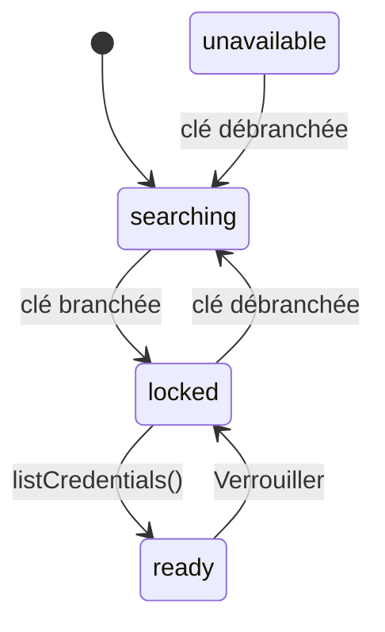
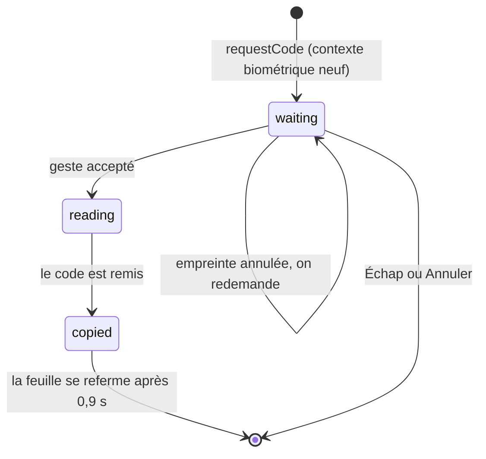

# Comment c'est fait

Deux cibles dans un seul paquet : `YubicoNotchKit` (toute la logique et les vues SwiftUI) et
`YubicoNotch` (vingt lignes : `NSApplication` + `AppController`). Pas de `.xcodeproj` :
SwiftPM construit, `Scripts/build-app.sh` assemble le bundle et le signe. macOS 14 minimum,
Swift 6, une seule dépendance — YubiKit, épinglé en 1.3.0.

## Le trajet d'un code

```mermaid
flowchart LR
    Hover[Survol de l'encoche] --> Expand[NotchWindowController.expand]
    Expand --> List["YubiKeyService.open()<br/>listCredentials()"]
    List --> Rows["Liste des comptes<br/>codes masqués ••• •••"]
    Rows --> Click[Clic sur un compte]
    Click --> Sheet[Feuille de confirmation]
    Sheet --> Gesture{Geste}
    Gesture -->|accepté| Compute["calculateCredentialCode<br/>pour ce seul credential"]
    Compute --> Done["Presse-papiers<br/>+ ligne révélée"]
```



Rien, sur ce trajet, n'est calculé d'avance : l'ouverture ne lit que des noms.

## Les couches

```
Sources/YubicoNotchKit/
  Model/   OATHAccount, OATHCode, OATHFailure, NewCredential (parsing otpauth://)
  Core/    NotchGeometry, CodeClock, Clipboard, Settings, Base32, BarcodeScanner,
           LaunchAtLogin, AppInfo, Log
  Auth/    BiometricGate (LocalAuthentication), OATHPasswordStore (trousseau)
  Key/     couture OATHSessionProtocol, adaptateur YubiKit, YubiKeyService, DemoYubiKey
  UI/      NotchPanel, NotchWindowController, NotchShape, vues SwiftUI
  App/     AppController (encoche + barre de menus + fenêtre Réglages)
```

Les dépendances pointent dans un seul sens : `App` connaît `UI` et `Key`, `UI` connaît
`Key`, et ni `Model` ni `Core` ne connaissent quoi que ce soit d'autre. Une décision
d'interaction pure (quelle ligne `↑` sélectionne, ce que fait `Échap`) vit dans
`UI/PanelLogic.swift`, sans vue ni fenêtre, pour être testable sans écran.

## Les coutures

Trois protocols isolent ce qui touche au matériel, au capteur et au presse-papiers. Sans
eux, aucun test ne pourrait parler à une YubiKey — et `swift test` ne le peut pas de toute
façon (voir plus bas).

| Protocol | Implémentations | Ce qu'il isole |
| --- | --- | --- |
| `OATHSessionProtocol` | `OATHSessionAdapter` (YubiKit), `FakeSession`, `DemoOATHSession` | le contenu de l'applet OATH |
| `YubiKeyConnecting` / `YubiKeyConnection` | `USBYubiKeyConnector`, `FakeConnector`, `FailingConnector` | la présence et la vie de la clé |
| `BiometricAuthenticating` | `BiometricGate`, `DemoBiometricGate`, les doubles de test | le geste de confirmation |
| `Pasteboard` | `SystemPasteboard`, `FakePasteboard` | le presse-papiers |

`YubiKeyService` ne connaît que ces protocols : c'est lui qui porte la machine à états, et
il se teste entièrement sans matériel.

## Le modèle : un geste, un code

Le panneau ne déverrouille pas la clé pour une session : il liste les comptes, et chaque
code est autorisé séparément.



`locked` veut dire « session OATH fermée : rien n'est listé ». Deux chemins y mènent, et
`lockedByUser` les distingue : soit le panneau vient de s'ouvrir et la liste arrive, soit
l'utilisateur a verrouillé — et dans ce cas la liste ne doit **pas** revenir toute seule
quand le guetteur se reconnecte, ce qu'il fait dans la seconde. Le verrou tient tant que le
panneau reste ouvert ; quitter l'encoche et y revenir est une intention neuve.

La confirmation, elle, a ses propres états :



`revealed` garde les codes confirmés encore dans leur fenêtre : une ligne révélée se
recopie d'un clic, mais **rien** n'est relu depuis la clé en arrière-plan. Quand la fenêtre
TOTP se termine, le code disparaît de la ligne ; le suivant demandera un nouveau geste.

## Le fil d'exécution

Tout est `@MainActor` : le service, la fenêtre, les vues. Deux boucles tournent en tâche de
fond détachée :

- **le guetteur** (`watcher`) : `connector.connect()` → `didConnect` → `waitUntilClosed()`
  → `didDisconnect`, en boucle, avec un délai de reprise plus long quand la clé est occupée
  par une autre application ;
- **l'horloge** (`ticker`) : elle publie `now`, d'où sont dessinés les anneaux et le pied du
  panneau. Cadence : une seconde quand le panneau est à l'écran, cinq sinon.

L'horloge est **redémarrée** à chaque changement de visibilité, pas seulement laissée
tourner. Sans ça, le sommeil de cinq secondes déjà en cours finit sa sieste et les anneaux
restent figés jusqu'à six secondes après l'ouverture de l'encoche.

## La fenêtre et le pointeur

`NSPanel` borderless, `.nonactivatingPanel`, niveau `.statusBar`, transparent, apparence
`.darkAqua` forcée (la dalle est noire comme l'encoche : les couleurs sémantiques doivent se
résoudre en clair). Elle est posée exactement sur l'encoche grâce à
`NSScreen.auxiliaryTopLeftArea` / `auxiliaryTopRightArea` et `safeAreaInsets.top`. Repliée,
elle fait la taille de l'encoche et ne dessine rien : ces pixels n'existent pas.

Elle ne vole le focus clavier que dans trois cas : un champ texte à l'écran (mot de passe
OATH, formulaire), une confirmation en cours (le prompt biométrique embarqué en a besoin
pour que la pression du capteur lui parvienne), et un clic dedans. Le survol, jamais.

Le suivi du pointeur demande **deux** moniteurs d'événements : un global (les mouvements
livrés aux autres apps, le cas normal pour une app de fond) et un local (les mouvements
livrés à notre propre panneau, sinon le repli programmé sur le chemin se déclencherait sous
le curseur). La décision survol / repli / clic est isolée dans
`NotchWindowController.pointerAction(for:geometry:isExpanded:isButtonDown:keepsPanelOpen:)`,
pure et testable sans souris.

`window.keepsPanelOpen` est piloté par `NotchRootView.pinPanel()` : il empêche le repli au
mouvement, pas au clic — un clic hors du panneau replie toujours, et abandonne la
confirmation en cours.

## La biométrie

`LAAuthenticationView` (`LocalAuthenticationEmbeddedUI`) est liée au `LAContext` du gate :
macOS dessine alors son prompt **dedans**, au lieu d'ouvrir sa propre alerte. Trois
conditions, chacune suffisante pour que « le Touch ID ne marche pas » :

1. la vue doit être **dans une fenêtre** avant l'appel à `evaluatePolicy` ;
2. la fenêtre doit pouvoir devenir **key** pendant le prompt ;
3. la feuille ne doit pas se replier pendant l'authentification.

Et une quatrième, qui n'est pas une condition mais la raison d'être du reste : **un contexte
neuf par confirmation**. La réutilisation vit dans le `LAContext` ; mesuré sur macOS 26, un
contexte qui a déjà reconnu un doigt répond à l'évaluation suivante en une dizaine de
millisecondes, sans nouveau toucher — c'est ainsi qu'une seule empreinte ouvrait tous les
codes. `BiometricGate.prepareForConfirmation()` invalide donc le contexte précédent et en
arme un neuf, avant même que la feuille existe, pour que la vue embarquée se lie au bon.

La durée de chaque évaluation est journalisée (`evaluatePolicy granted in …`) : c'est le
seul moyen de voir la fuite si elle revient.

## L'accès à la carte à puce

`Resources/YubicoNotch.entitlements` porte `com.apple.security.smartcard`, et
`Scripts/build-app.sh` signe en ad hoc. Ce n'est pas décoratif : mesuré sur macOS 26, un
binaire **non signé** voit `TKSmartCardSlotManager.default` à `nil` même quand la YubiKey
est branchée et le lecteur listé par le système — et YubiKit plante alors sur
`assertionFailure` dans un build debug.

Conséquence pour les tests : `swift test` ne peut pas parler à la clé (le binaire de test
n'est pas signé). Pour exercer le matériel, il faut passer par l'app et son drapeau
`-confirm`, qui ouvre le panneau, attend la liste et demande le premier compte : la feuille
fait le reste, il ne reste qu'à poser le doigt.

## Les tests

`swift test`, Swift Testing, 90 tests. Trois familles :

- **le pur** : Base32, le parsing `otpauth://`, l'arithmétique des fenêtres TOTP, la
  géométrie de l'encoche, les règles d'interaction (`PanelLogic`) ;
- **le service** : la machine à états complète, avec des doubles pour la clé, le gate et le
  presse-papiers — un geste, un code ; une empreinte annulée ne remet rien ; le verrou tient ;
  l'horloge redémarre ;
- **l'interaction** (`PanelInteractionTests`) : de vrais `NSEvent` envoyés à notre propre
  fenêtre via `NSApp.sendEvent`, sans permission d'accessibilité. Une suite sérialisée, parce
  que les moniteurs d'événements sont globaux à l'app.

Deux pièges y sont encodés, appris à la frapper :

- un test qui bloque le thread principal dans `RunLoop.run(until:)` ne réveille **jamais** un
  `Task.sleep` : pour éprouver un appui maintenu, il faut `await` entre l'appui et le
  relâchement, jamais un `settle()` synchrone ;
- un clic sur un `Button` SwiftUI est traité **synchroniquement** par `NSApp.sendEvent`,
  alors que le moniteur local le traite de façon asynchrone : les assertions qui passent par
  le moniteur doivent attendre.
