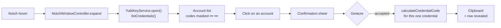
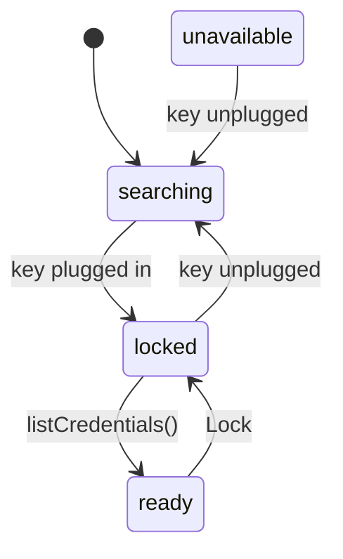
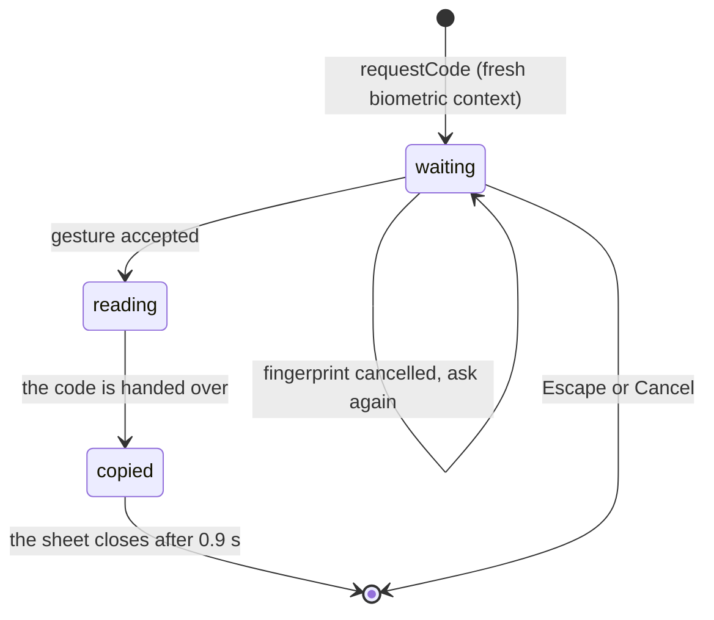

# How it works

Two targets in one package: `YubicoNotchKit` (all the logic and the SwiftUI views) and
`YubicoNotch` (twenty lines: `NSApplication` + `AppController`). No `.xcodeproj`:
SwiftPM builds, `Scripts/build-app.sh` assembles the bundle and signs it. macOS 14 minimum,
Swift 6, a single dependency — YubiKit, pinned at 1.3.0.

## The path of a code



Nothing on this path is computed ahead of time: opening only reads names.

## The layers

```
Sources/YubicoNotchKit/
  Model/   OATHAccount, OATHCode, OATHFailure, NewCredential (otpauth:// parsing)
  Core/    NotchGeometry, CodeClock, Clipboard, Settings, Base32, BarcodeScanner,
           LaunchAtLogin, AppInfo, Log
  Auth/    BiometricGate (LocalAuthentication), OATHPasswordStore (keychain)
  Key/     OATHSessionProtocol seam, YubiKit adapter, YubiKeyService, DemoYubiKey
  UI/      NotchPanel, NotchWindowController, NotchShape, SwiftUI views
  App/     AppController (notch + menu bar + Settings window)
```

Dependencies point one way: `App` knows `UI` and `Key`, `UI` knows
`Key`, and neither `Model` nor `Core` knows anything else. A pure
interaction decision (which row `↑` selects, what `Escape` does) lives in
`UI/PanelLogic.swift`, with no view and no window, so it is testable without a screen.

## The seams

Three protocols isolate what touches the hardware, the sensor and the clipboard. Without
them, no test could talk to a YubiKey — and `swift test` cannot do it anyway (see below).

| Protocol | Implementations | What it isolates |
| --- | --- | --- |
| `OATHSessionProtocol` | `OATHSessionAdapter` (YubiKit), `FakeSession`, `DemoOATHSession` | the contents of the OATH applet |
| `YubiKeyConnecting` / `YubiKeyConnection` | `USBYubiKeyConnector`, `FakeConnector`, `FailingConnector` | the presence and the life of the key |
| `BiometricAuthenticating` | `BiometricGate`, `DemoBiometricGate`, the test doubles | the confirmation gesture |
| `Pasteboard` | `SystemPasteboard`, `FakePasteboard` | the clipboard |

`YubiKeyService` knows only these protocols: it carries the state machine, and
it is fully testable without hardware.

## The model: one gesture, one code

The panel does not unlock the key for a session: it lists the accounts, and every
code is authorized separately.



`locked` means "OATH session closed: nothing is listed". Two paths lead there, and
`lockedByUser` tells them apart: either the panel just opened and the list is on its way, or
the user locked — and in that case the list must **not** come back on its own
when the watcher reconnects, which it does within the second. The lock holds as long as the
panel stays open; leaving the notch and coming back is a new intent.

The confirmation has its own states:



`revealed` keeps confirmed codes still inside their window: a revealed row
copies again with one click, but **nothing** is re-read from the key in the background. When the TOTP
window ends, the code disappears from the row; the next one will ask for a new gesture.

## The thread

Everything is `@MainActor`: the service, the window, the views. Two loops run on a detached
background task:

- **the watcher** (`watcher`): `connector.connect()` → `didConnect` → `waitUntilClosed()`
  → `didDisconnect`, in a loop, with a longer retry delay when the key is busy
  with another application;
- **the clock** (`ticker`): it publishes `now`, from which the rings and the panel footer are
  drawn. Rate: one second when the panel is on screen, five otherwise.

The clock is **restarted** on every visibility change, not just left running. Without
that, the five-second sleep already in flight finishes its nap and the rings stay frozen for
up to six seconds after the notch opens.

## The window and the pointer

Borderless `NSPanel`, `.nonactivatingPanel`, `.statusBar` level, transparent, forced
`.darkAqua` appearance (the slab is black like the notch: semantic colors must
resolve to light). It sits exactly on the notch using
`NSScreen.auxiliaryTopLeftArea` / `auxiliaryTopRightArea` and `safeAreaInsets.top`. Collapsed,
it is the size of the notch and draws nothing: those pixels do not exist.

It steals keyboard focus in only three cases: a text field on screen (OATH password,
form), a confirmation in progress (the embedded biometric prompt needs it
for the sensor press to reach it), and a click inside. Hover, never.

Pointer tracking needs **two** event monitors: a global one (movements
delivered to other apps, the normal case for a background app) and a local one (movements
delivered to our own panel, otherwise the collapse scheduled along the path would
fire under the cursor). The hover / collapse / click decision is isolated in
`NotchWindowController.pointerAction(for:geometry:isExpanded:isButtonDown:keepsPanelOpen:)`,
pure and testable without a mouse.

`window.keepsPanelOpen` is driven by `NotchRootView.pinPanel()`: it blocks collapse on
movement, not on click — a click outside the panel always collapses it, and
drops the confirmation in progress.

## Biometrics

`LAAuthenticationView` (`LocalAuthenticationEmbeddedUI`) is bound to the gate's `LAContext`:
macOS then draws its prompt **inside**, instead of opening its own alert. Three
conditions, each one enough for "Touch ID is not working":

1. the view must be **in a window** before the call to `evaluatePolicy`;
2. the window must be able to become **key** during the prompt;
3. the sheet must not collapse during authentication.

And a fourth one, which is not a condition but the reason the rest exists: **a fresh
context for every confirmation**. Reuse lives in the `LAContext`; measured on macOS 26, a
context that has already matched a finger answers the next evaluation in about ten
milliseconds, with no new touch — that is how a single fingerprint used to open every
code. `BiometricGate.prepareForConfirmation()` therefore invalidates the previous context and
arms a fresh one, before the sheet even exists, so that the embedded view binds to the right
one.

The duration of every evaluation is logged (`evaluatePolicy granted in …`): it is the
only way to see the leak if it comes back.

## Smart card access

`Resources/YubicoNotch.entitlements` carries `com.apple.security.smartcard`, and
`Scripts/build-app.sh` signs ad hoc. This is not decoration: measured on macOS 26, an
**unsigned** binary sees `TKSmartCardSlotManager.default` as `nil` even when the YubiKey
is plugged in and the reader is listed by the system — and YubiKit then crashes on
`assertionFailure` in a debug build.

Consequence for tests: `swift test` cannot talk to the key (the test binary
is not signed). To exercise the hardware, go through the app and its `-confirm` flag, which
opens the panel, waits for the list and asks for the first account:
the sheet does the rest, all that is left is to place a finger.

## The tests

`swift test`, Swift Testing, 90 tests. Three families:

- **the pure ones**: Base32, `otpauth://` parsing, TOTP window arithmetic, notch
  geometry, interaction rules (`PanelLogic`);
- **the service**: the full state machine, with doubles for the key, the gate and the
  clipboard — one gesture, one code; a cancelled fingerprint hands nothing over; the lock holds;
  the clock restarts;
- **interaction** (`PanelInteractionTests`): real `NSEvent`s sent to our own
  window through `NSApp.sendEvent`, with no accessibility permission. A serialized suite, because
  the event monitors are app-global.

Two traps are encoded there, learned the hard way:

- a test that blocks the main thread in `RunLoop.run(until:)` **never** wakes a
  `Task.sleep`: to exercise a press and hold, you must `await` between the press and the
  release, never a synchronous `settle()`;
- a click on a SwiftUI `Button` is handled **synchronously** by `NSApp.sendEvent`,
  while the local monitor handles it asynchronously: assertions that go through
  the monitor must wait.
